*Lomonosov Moscow State University*

Anastasia Shurygina
ashurygina@geogr.msu.ru

German Titov
titovgs@my.msu.ru

The experience of creating animal maps, only to later find myself extracting data from similar publications. We'll explore why a purely geoanalytical approach isn't always enough, and then look ahead to the future of animal mapping, where advanced technologies and a commitment to open data can finally make powerful research tools accessible to everyone.

Also:
1. How Amur goral looks like
2. The word “irony”. Twice
3. The name of Neapolitan song
 
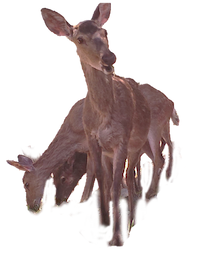
*look!*

## Why Don't We Share the Secret Sauce (1)

Regular observations using accounting routes and camera traps are foundational to acquire data for animal mapping.

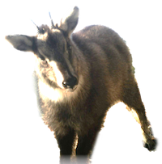
*that's how Amur goral looks like*

Specialists produce high-quality spatial data, but this raw data is rarely shared. It's typically presented in scientific articles as maps and text descriptions.

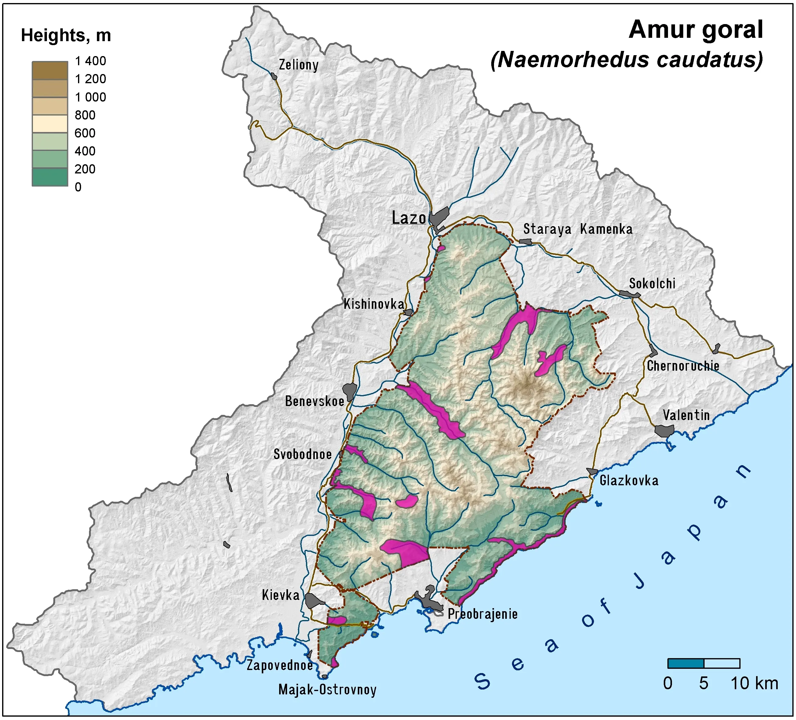

The typical workflow involves several steps:

1. Data Parsing: Spatial data is extracted from collected occurrence records.
2. GIS Integration: This data is imported into a GIS project (like QGIS) combined with contextual layers such as elevation, landscape structure, and rivers.
3. Areal Construction: A skilled cartographer, who must possess extensive knowledge in both geography and biology, constructs the final areal map.

This process yields high-level data, but its quality is heavily dependent on the original data and the cartographer's expertise. The reliance on a single individual with such a broad skillset highlights a key limitation of the approach.

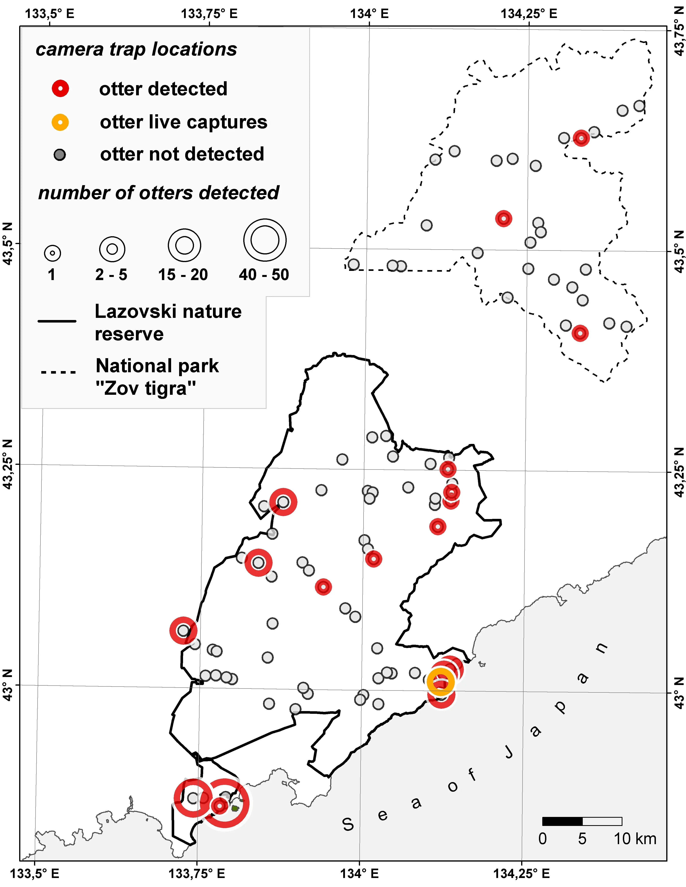

[Goncharuk, M. S., Voloshina, I. V., Aramilev, V. V., Shurygina, A. A., & Kerley, L. L. (2020). Recent Observations of Eurasian Otter Lutra lutra, including White-Coated Individuals, in the Southern Sikhote Alin, the Russian Far East. IUCN/SCC Otter Specialist Group Bulletin, 37(3), 147–157.](https://www.iucnosgbull.org/Volume37/Goncharuk_et_al_2020.pdf)

> My experience as a cartographer for the Lazovsky Reserve in the Russian Far East taught me a valuable lesson. I found that without extensive consultation with the biologists who study the mapped species, the resulting areal maps were likely to be less reliable. This firsthand experience highlights the critical importance of interdisciplinary collaboration.

.webp>)

## When Life Gives You Articles, Make ~Lemonade~ Spatial Data (2)

> The irony is personal: I once created animal maps, only to later find myself extracting data from similar publications. This firsthand experience underscored the widespread nature of the data accessibility challenge. Let’s advocate to share the raw data but for now Funiculì-Funiculà.

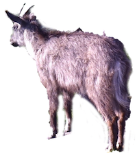
*literally me thinking about irony of fate*

Because original spatial data is rarely shared, researchers who need to perform reviews or meta-analyses must extract spatial information from existing articles.

This reverse-engineering process involves three core steps: detect, extract, and verify. For text data, extraction usually includes geocoding, while for maps, it involves identifying a spatial reference and digitizing map features. Verification is a crucial step where you cross-check your results against the article's content, comparing text data with maps and vice versa when both are presented.

One challenge is the inherent loss of data and precision. Information is inevitably lost during both the creation of the original maps and the subsequent data extraction process. This loss should be transparent to the end user. 

Another challenge is the need for significant human effort to extract data. While the variability and complexity of spatial data mean that human effort is often more effective, this process has great potential for automation. Artificial intelligence and Large Language Models (LLMs) could streamline these steps, making it much easier to extract and analyze data from articles.

Examples of the maps
of fungi species produced using spatial data extracted from articles

The maps are from article as well

[Grum-Grzhimaylo, O. A., Shurigina, A. A., Debets, A. J. M., & Aanen, D. K. (2024). Biogeography and uniqueness of filamentous terrestrial fungi in the polar regions. Fungal Biology Reviews, 49, 100382.](http://dx.doi.org/10.1016/j.fbr.2024.100382)

## The Seagull Chronicles: A Geoanalytical Experiment (3)

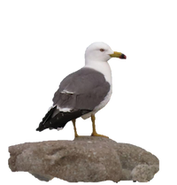
*Larus crassirostris*

Traditional methods rely on extensive expert knowledge. Experts often exclude data points they deem irrelevant based on their understanding of the species and the geographic area. Less biased approach can be achieved by utilizing geoanalytical methods.

We once used this approach to study a seagull colony on a small island during nesting season. By studying a geographically homogeneous area, we can argue that the spatial distribution of animals is dictated primarily by their behavior and mutual interactions, rather than by external geographical factors.

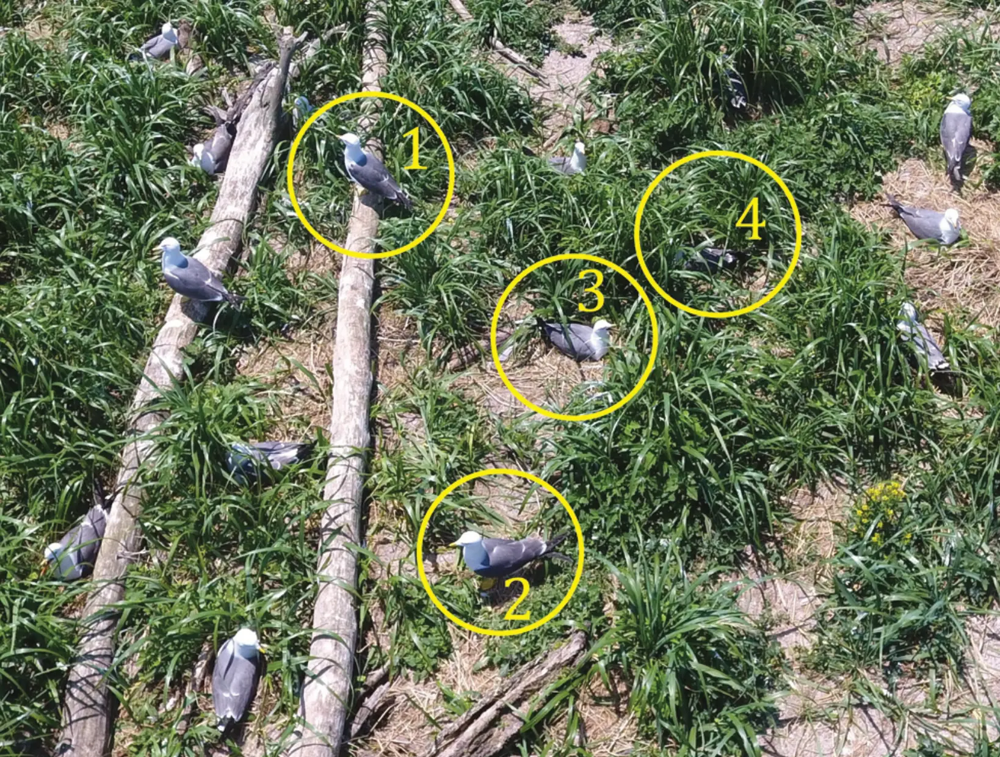
*find the sniper: easy mode*

By abstracting from geographic influence, we found a distinct point pattern: nests were clustered at the start of the season, became more regular at the peak. This suggested that the birds initially clustered around optimal spots before spreading out. Finding is based on point pattern analysis.

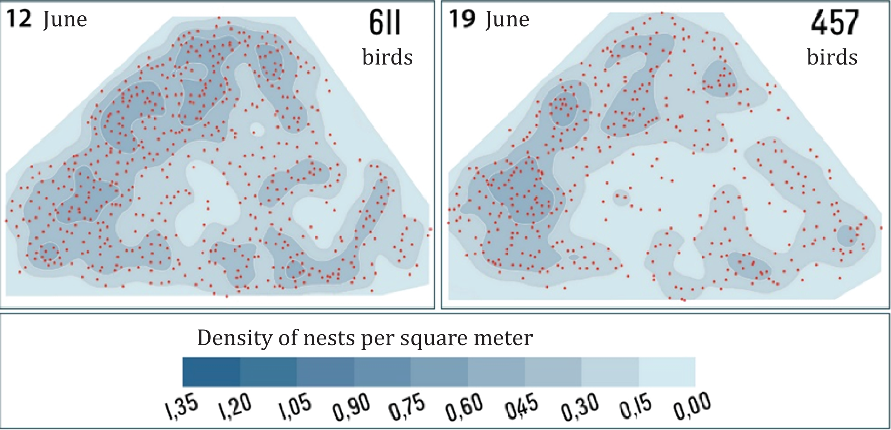

## Your New Best Friend: GIS So Easy a Biologist Can Do It (4)

But analyzing animal spatial distribution without geographical parameters is an exception. Recent advances in cartography and geoinformatics have opened up new opportunities for animal mapping.

For example, we studied marine animals in the Arctic by integrating various datasets — including biotic and abiotic environmental parameters and maritime traffic density — from sources like Copernicus, IUCN, and Global Maritime Traffic Density Service. Using the hexagonal Discrete Global Grid System (H3) as a spatial framework, we minimized distortion at high latitudes and created an efficient visualization with DeckGL.

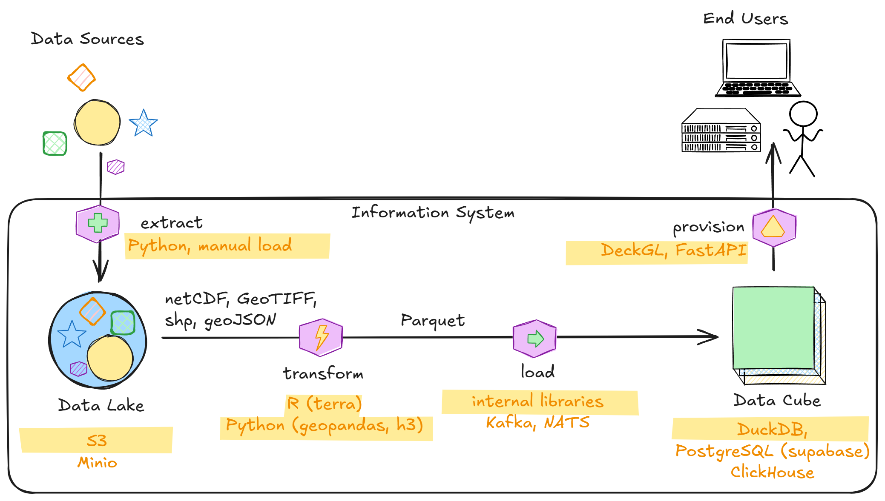

This allowed an expert to set optimal and limiting values for parameters and instantly generate a probable species areal, which could then be compared with IUCN maps.

Although the underlying information system is complex — involving data extraction, integration, API layer, and visualization — this complexity is hidden from the end user. The system provides a fast and reliable web interface, making sophisticated cartography and GIS as easy to use as an online game, and empowering biologists and geographers to work with complex data without needing extensive technical knowledge.

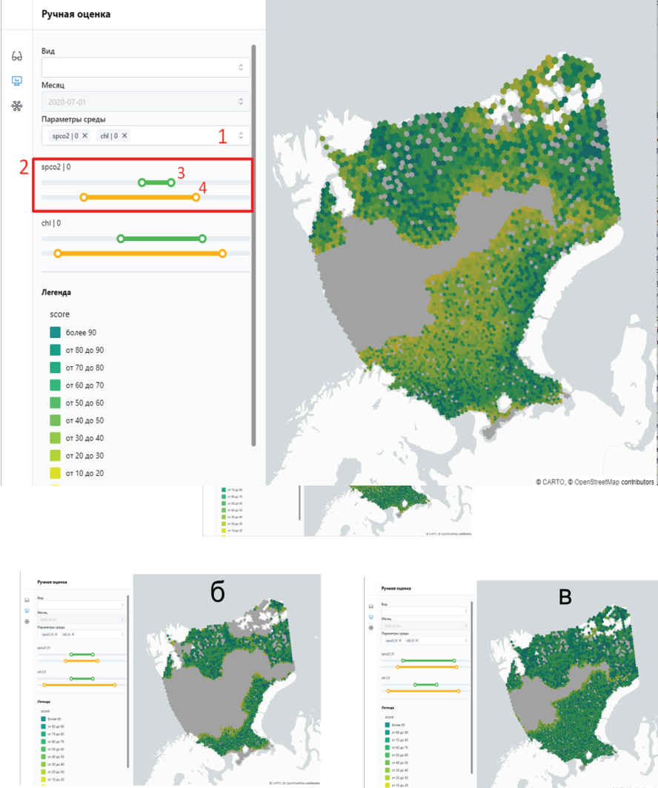

[A. Shurygina and G. Titov, "Building Datacube for Maritime Applications on Discrete Global Grid System," IGARSS 2022 - 2022 IEEE International Geoscience and Remote Sensing Symposium, Kuala Lumpur, Malaysia, 2022, pp. 2446-2449](https://ieeexplore.ieee.org/document/9884498)

[Titov, G., & Kargashin, P. (2024). Arctic seas data cube based on discrete global grid system. Abstracts of the ICA, 7, 1–2.](https://ica-abs.copernicus.org/articles/7/172/2024/)

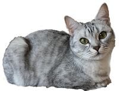
*co-author*